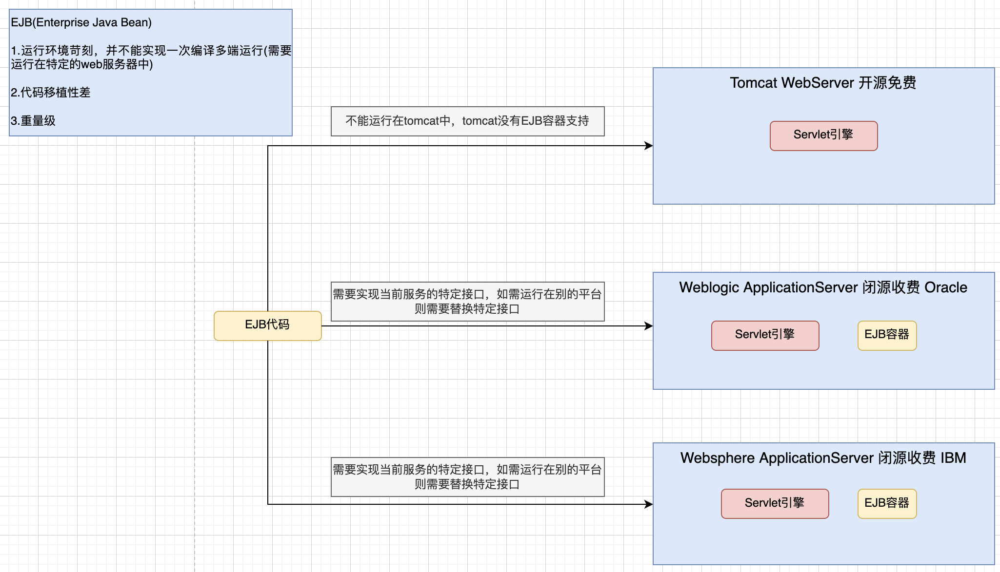
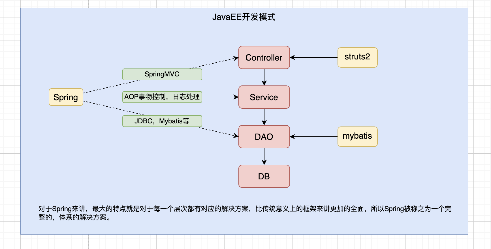
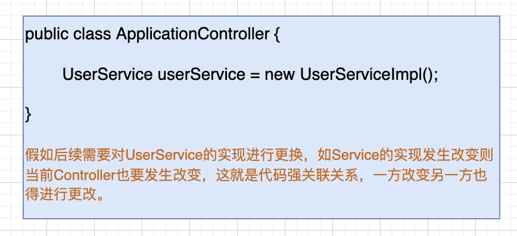

# 引言
## 1. EJB(Enterprise Java Bean)存在的问题
```markdown
1. 运行环境苛刻，运行环境变化代码也需要相应调整
2. 代码移植性差
3. 重量级框架
如下图
```


## 2. 什么是Spring
```markdown
 1. Spring是一个轻量级的JavaEE解决方案，整合了众多优秀的设计模式。
```
### 2.1. 为什么说是轻量级？
```markdown
1. 对运行环境没有额外要求，不仅可运行在开源web服务器中，如tomcat、resion、jetty，对收费的也支持，如weblogic、websphere
2. 代码移植性高，不需要实现额外的接口，通过上图可看出↑
```
### 2.2. 为什么可以称之为JavaEE解决方案？

### 2.3. 为什么能够做到轻量级，能够成为一个完整的解决方案？
```markdown
 通过Spring源码可看出，Spring是对原有设计模式的高度封装整合，内部包含工厂、代理、策略、模版等设计模式的合理封装。
```
## 3. 设计模式概念
```markdown
1. 广义概念
面向对象设计中，解决特定问题的经典代码，可以认为只要是一些经典的代码都可以称之为设计模式
2. 狭义概念
GOF4人帮所定义的23种设计模式，例如：工厂、单例、适配器，装饰器、门面、代理、模版等等
```
## 4. 工厂设计模式
### 4.1 什么是工厂设计模式
```markdown
1. 概念：通过工厂类来创建对象
原始的对象创建则直通过关键字new来声明，例如：
    User user = new User();
    UserDAO userDAO = new UserDAOImpl();
在工厂设计模式当中，并不提倡这种直接new的方式来创建对象，而是通过一个第三方的工厂类来创建。例如：
    User user = BeanFactory.getBean("xxx");
    UserDAO userDAO = BeanFactory.getBean("xxx");
那么此时问题就来了，直接new不好吗？为什么还需要通过工厂类来创建？这样不是更加麻烦？
2. 针对上述问题就引出了工厂类的好处
    解耦合，降低耦合
3. 什么是耦合？
耦合指的是代码间的强关联关系，一方的改变会影响到另一方，不利于代码的维护。
如上述通过new直接创建对象，假如有一天业务逻辑需求发生改变，需要换个类进行引用，那就需要
修改源代码进行调整(不符合开闭原则)。那工厂则可直接通过配置进行调整，不需要进行源代码的修改，
只需要新增业务类然后进行配置即可(符合开闭原则)。耦合关系如下图
```

### 4.2 简单工厂的设计
```java
package com.design.gof.created.factory.method.demo3;

import java.io.IOException;
import java.io.InputStream;
import java.util.Properties;

/**
 * 通过简单工厂将代码耦合转移到配置文件中
 * Created by Ale on 2022/3/14
 */
public class BeanFactory {

    private static Properties env = new Properties();

    static {
        InputStream inputStream = null;
        try {
            /**
             * 1、通过当前对象流读取 properties 中配置信息
             * properties 配置如下
             * userService = com.design.gof.created.factory.method.demo3.UserServiceImpl
             */
            inputStream = BeanFactory.class.getResourceAsStream("/applicationContext.properties");

            /**
             * 2、把流加载到Properties集合当中
             */
            env.load(inputStream);
        } catch (IOException e) {
            e.printStackTrace();
        } finally {
            try {
                if (null != inputStream) {
                    inputStream.close();
                }
            } catch (IOException e) {
                e.printStackTrace();
            }
        }
    }

    /**
     * 对象的创建方式
     * 1.传统的创建方式直接调用构造方法进行创建，
     * 例如：UserService userService = new UserServiceImpl();
     * 2.通过反射的形式来创建对象，可解决耦合
     * Class clazz = Class.forName("com.xxx.xxx.xxx.某个类");
     * UserService userService = (UserService) clazz.newInstance();
     * @return
     */
    public static UserService getUserService() {
        UserService userService = null;
        try {
            Class clazz = Class.forName(env.getProperty("userService"));
            userService = (UserService) clazz.newInstance();
        } catch (ClassNotFoundException e) {
            e.printStackTrace();
        } catch (InstantiationException e) {
            e.printStackTrace();
        } catch (IllegalAccessException e) {
            e.printStackTrace();
        }
        return userService;
    }
}
```

```java
package com.design.gof.created.factory.method.demo3;

/**
 * Created by Ale on 2022/3/14
 */
public class User {

    private String username;
    private String password;

    public User() {
    }

    public User(String username, String password) {
        this.username = username;
        this.password = password;
    }

    public String getUsername() {
        return username;
    }

    public void setUsername(String username) {
        this.username = username;
    }

    public String getPassword() {
        return password;
    }

    public void setPassword(String password) {
        this.password = password;
    }
}
```
```java
package com.design.gof.created.factory.method.demo3;

/**
 * Created by Ale on 2022/3/14
 */
public interface UserService {

    void register(User user);

    void login(String username, String password);
}
```

```java
package com.design.gof.created.factory.method.demo3;

/**
 * Created by Ale on 2022/3/14
 */
public class UserServiceImpl implements UserService {
    private UserDAO userDAO = new UserDAOImpl();

    @Override
    public void register(User user) {
        userDAO.save(user);
    }

    @Override
    public void login(String username, String password) {
        userDAO.findByUsernameAndPassword(username, password);
    }
}
```

```java
package com.design.gof.created.factory.method.demo3;

/**
 * Created by Ale on 2022/3/14
 */
public interface UserDAO {

    void save(User user);

    void findByUsernameAndPassword(String username, String password);
}
```

```java
package com.design.gof.created.factory.method.demo3;

/**
 * Created by Ale on 2022/3/14
 */
public class UserDAOImpl implements UserDAO {

    @Override
    public void save(User user) {
        System.out.println("save user");
    }

    @Override
    public void findByUsernameAndPassword(String username, String password) {
        System.out.println("query user by username and password");
    }
}
```

```java
package com.design.gof.created.factory.method.demo3;

/**
 * Created by Ale on 2022/3/14
 */
public class Client {

    public static void main(String[] args) {
        /**
         * 传统业务调用
         */
        // UserService userService = new UserServiceImpl();
        UserService userService = BeanFactory.getUserService();
        User user = new User("admin", "1234");
        userService.register(user);

        userService.login("admin", "1234");
    }
}
```